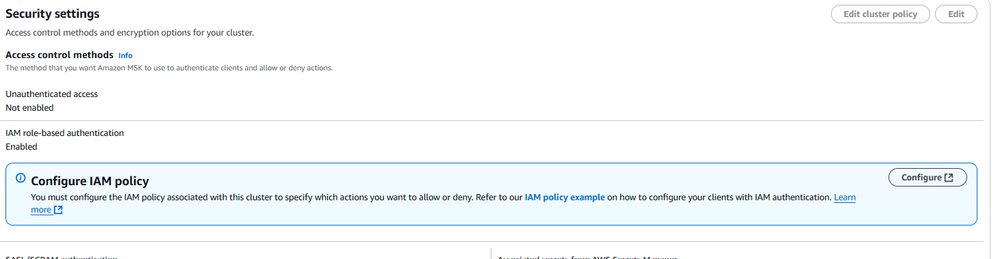

# 🔌 Connecting to Amazon MSK with Kafka UI

Managing Apache Kafka doesn't have to be hard — AWS MSK makes it easy.  No big config files, no big setup , no passwords 

## 🛠️ What You Need

- ✅ An AWS MSK cluster (with IAM or TLS auth)
- ✅ A valid AWS CLI profile (e.g., `default`, `dev`, `msk-admin`)
- ✅ The `aws-msk-iam-auth` JAR file from [Amazon Docs](https://docs.aws.amazon.com/msk/latest/developerguide/iam-client-auth.html)
- ✅ Docker and Docker Compose installed

## 📦 Folder Structure

project-folder/
├── docker-compose.yml
└── libs/
    └── aws-msk-iam-auth-1.1.7-all.jar

## 🔍 How to Get the Bootstrap Servers

Run the following command to get the broker endpoints (TLS or IAM):

```bash
aws kafka get-bootstrap-brokers \
  --cluster-arn <your-msk-cluster-arn> \
  --profile <your-profile-name>

```
## How to run 

```
cd project-folder 

docker-compose up

Try http://localhost:8080
```

### Common issues and trouble shooting 

make sure to enable IAM role based authentication 



Connection Timeout - Check the network conenctivity 

#### Is MSK Public or Private?
If it's in private subnet:

You CANNOT connect directly from your laptop

You need to:

- Use a bastion host (EC2) in the same VPC and install Kafka UI there

- use AWS PrivateLink + VPN


IAM Errors

Please check the permission of the AWS IAM profile from local , by default it will pick a default profile . Please specify the profile in docker-compose.yml